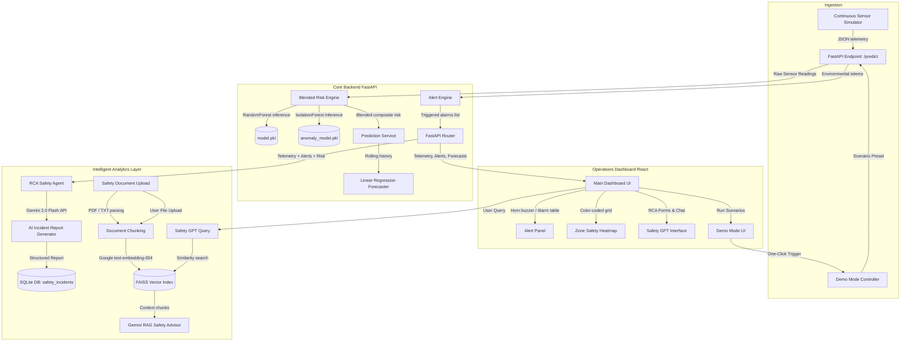
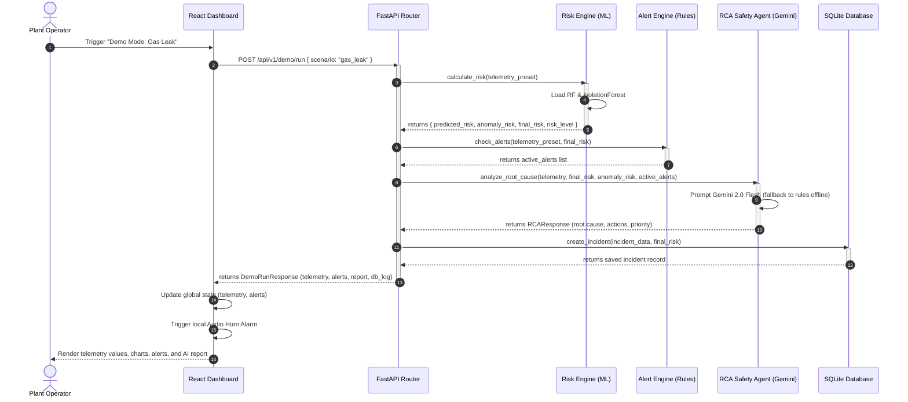
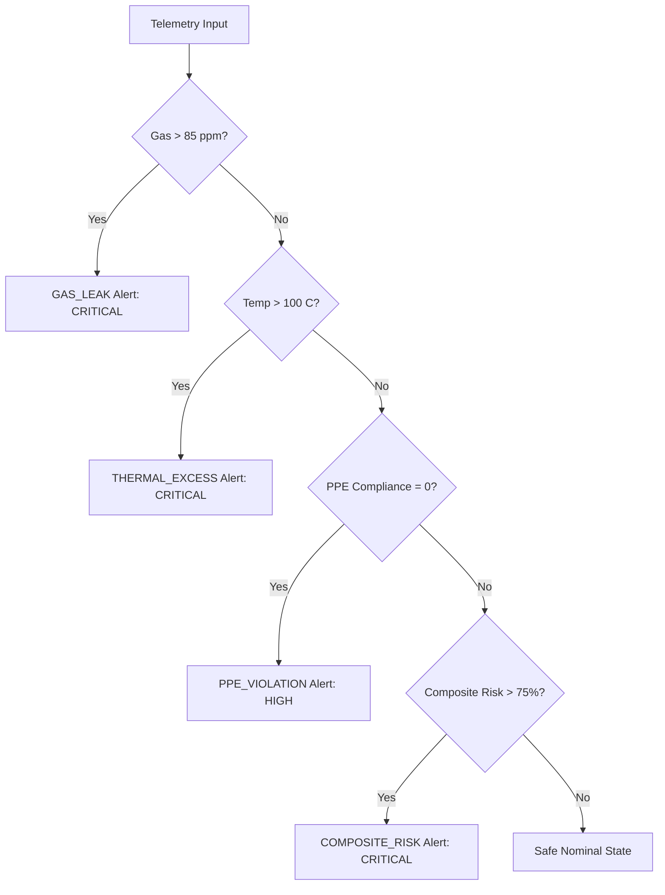
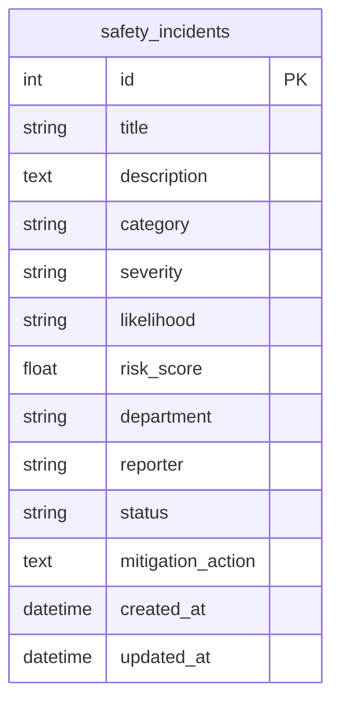

# Industrial Safety Intelligence Platform (ISIP) - Complete Project Documentation

Welcome to the comprehensive technical, architectural, and operational documentation of the **Industrial Safety Intelligence Platform (ISIP)**. This document serves as the single source of truth for understanding, running, maintaining, and auditing the platform.

---

## 📖 1. Executive Summary

### Platform Overview
The **Industrial Safety Intelligence Platform (ISIP)** is a centralized, real-time control room SCADA console designed to monitor and predict environmental and operational hazards in industrial facilities. It integrates raw sensor telemetry with machine learning risk regression, unsupervised anomaly detection, rule-based alarm dispatches, and LLM-powered safety advice and incident reporting.

### Main Business Problem Solved
Industrial facilities suffer from fragmented safety procedures. Environmental sensors (e.g. gas, temperature, vibration) are usually siloed from compliance monitoring (e.g. PPE inspections). When a hazard occurs, safety officers lack a unified visual overview, leading to delayed response times and incomplete safety logs. ISIP solves this by fusing real-time telemetry inputs into a single risk score and automating the root cause diagnosis and SOP updates.

### Key AI Capabilities
* **Unified Blended ML Risk Engine**: Combines a `RandomForestRegressor` (evaluating multi-variable operations) and an `IsolationForest` (identifying deviations from normal baselines) into a weighted composite risk score (70% regression, 30% anomaly).
* **Predictive Hazard Forecasting**: Fits a rolling-window linear regression to predict risk vectors 5, 10, and 15 minutes into the future.
* **Safety GPT Co-Pilot (RAG)**: A vector search assistant indexing safety regulations, standard operating procedures, and OSHA manuals to answer safety queries with strict context boundaries.
* **Root Cause Analysis (RCA) Agent**: A Gemini safety agent that correlates active alarms, risk predictions, and anomalies to diagnose root failures and prioritize incidents.
* **Automated SOP Report Generator**: Creates structured incident summaries, immediate containment checklists, and long-term prevention rules using Gemini structured outputs.

### Intended Users
* **Control Room Operators**: Track live sensor indicators, respond to audible alarms, and acknowledge warnings.
* **Safety Officers / Managers**: Direct field personnel using AI-suggested SOPs, resolve alarms, and generate OSHA compliance reports.
* **Compliance Auditors**: Query the Safety GPT knowledge base and review historical safety incident databases.

---

## 🏗️ 2. System Architecture

The platform follows a standard client-server architecture with an independent telemetry simulator:



### Component Roles & Ingestion Pipeline
1. **Sensor Simulator (`sensor_simulator.py`)**: Continuously pushes JSON packets containing sensor attributes to the backend.
2. **FastAPI Server (`main.py`)**: Receives requests, processes them through the Risk and Alert engines, logs incidents in the DB, and serves queries.
3. **ML Risk Engine (`risk_engine.py`)**: Checks if pre-trained models exist; if missing, it auto-trains them. Computes a blended risk percentage.
4. **Alert Engine (`alert_engine.py`)**: Implements threshold safety rules to dispatch structured alarms concurrently.
5. **RAG Advisor (`chain.py`, `vector_store.py`)**: Stores safety manual embeddings in a local FAISS index, retrieves top contexts, and utilizes Gemini to draft factual responses.
6. **Incident Report Generator (`incident_report.py`)**: Leverages Gemini’s structured output schema to produce detailed root cause analyses, immediate action checklists, and SOP recommendations.
7. **SQLite Database**: Persists incident tickets, categories, departments, and mitigations.
8. **React Frontend Dashboard**: Visualizes data using Recharts, triggers demo scenarios, renders the Safety Heatmap, sounds SCADA sirens, and hosts the SafetyGPT chat.

---

## 🔄 3. Request Lifecycle & Data Flow

Below is the request lifecycle for a simulated scenario trigger (e.g. Gas Leak):



---

## 📂 4. Project Folder Structure & Module Analysis

### Backend Folders & Metadata
```text
backend/
├── api/
│   ├── schemas/            # Pydantic schemas (validations)
│   ├── deps.py             # Dependency injection singletons
│   └── v1/                 # API Endpoint Routers
│       ├── endpoints/      # Handlers (chat, prediction, demo, incidents)
│       └── router.py       # API central router index
├── data/                   # Serialized model binaries, CSV dataset, SQLite DB
├── models/                 # SQLAlchemy models
├── rag/                    # Ingestion processors, vector stores, LCEL chains
├── services/               # Core business logic (Risk, Alerts, RCA, Reports)
├── utils/                  # Shared configurations and logging utilities
├── main.py                 # FastAPI bootstrapper
├── sensor_simulator.py     # Telemetry generator CLI script
└── requirements.txt        # Backend python dependencies
```

| File / Folder Path | Component Purpose | Primary Dependencies | Key Functions / Classes |
| :--- | :--- | :--- | :--- |
| [backend/main.py](file:///c:/Users/Lalith%20Sai%20Kumar/Documents/ISIP/backend/main.py) | Application entry point; initializes SQLite tables, checks model files, configures CORS, and registers versioned API endpoints. | `fastapi`, `uvicorn`, `sqlalchemy` | `lifespan(app)`, `health_check()` |
| [backend/sensor_simulator.py](file:///c:/Users/Lalith%20Sai%20Kumar/Documents/ISIP/backend/sensor_simulator.py) | A multi-threaded simulation script pushing continuous telemetry to the backend `/predict` endpoint every 5 seconds. | `requests`, `threading`, `tabulate` | `send_telemetry()`, `scenario_worker()` |
| [backend/train_model.py](file:///c:/Users/Lalith%20Sai%20Kumar/Documents/ISIP/backend/train_model.py) | Generates synthetic dataset `industrial_safety.csv` and trains the `RandomForestRegressor`. | `pandas`, `sklearn`, `joblib` | `generate_synthetic_data()`, `train_pipeline()` |
| [backend/services/risk_engine.py](file:///c:/Users/Lalith%20Sai%20Kumar/Documents/ISIP/backend/services/risk_engine.py) | Fuses the RandomForestRegressor prediction and IsolationForest anomaly score into a unified composite safety score. | `numpy`, `pandas`, `joblib` | `calculate_risk()`, `train_models_on_startup()` |
| [backend/services/alert_engine.py](file:///c:/Users/Lalith%20Sai%20Kumar/Documents/ISIP/backend/services/alert_engine.py) | Formulates threshold-based alert triggers and severity evaluation logic. | Standard Library | `check_alerts()`, `eval_severity()` |
| [backend/services/anomaly_detection.py](file:///c:/Users/Lalith%20Sai%20Kumar/Documents/ISIP/backend/services/anomaly_detection.py) | Trains and performs inference using the `IsolationForest` unsupervised model to evaluate environmental telemetry drift. | `sklearn`, `joblib` | `IsolationForestAnomalyDetector` |
| [backend/services/rca_agent.py](file:///c:/Users/Lalith%20Sai%20Kumar/Documents/ISIP/backend/services/rca_agent.py) | Safety agent that leverages Gemini to diagnose root failures based on telemetry, active alerts, and predicted risks. | `langchain_google_genai` | `RcaAgent`, `RCAResponse` |
| [backend/services/incident_report.py](file:///c:/Users/Lalith%20Sai%20Kumar/Documents/ISIP/backend/services/incident_report.py) | Synthesizes formal incident summaries, containment steps, and recommended SOP changes. | Standard Library | `IncidentReportGenerator` |
| [backend/services/demo_mode.py](file:///c:/Users/Lalith%20Sai%20Kumar/Documents/ISIP/backend/services/demo_mode.py) | Coordinates demo scenarios (Gas Leak, Machine Overheating, PPE Violation, Combined Catastrophe) and logs results. | `sqlalchemy` | `run_demo_scenario()` |
| [backend/rag/chain.py](file:///c:/Users/Lalith%20Sai%20Kumar/Documents/ISIP/backend/rag/chain.py) | Builds the LangChain query sequence, linking similarity context with ChatGoogleGenerativeAI (Gemini) prompts. | `langchain_google_genai` | `RAGSafetyChain`, `answer_question()` |
| [backend/rag/vector_store.py](file:///c:/Users/Lalith%20Sai%20Kumar/Documents/ISIP/backend/rag/vector_store.py) | Directs vector database operations (indexing documents and running vector similarity lookups in FAISS). | `FAISS`, `langchain_community` | `VectorStoreManager` |
| [backend/rag/document_processor.py](file:///c:/Users/Lalith%20Sai%20Kumar/Documents/ISIP/backend/rag/document_processor.py) | Extracts and chunks raw document text from PDF, MD, and TXT files for embedding ingestion. | `PyPDF2`, `langchain` | `DocumentProcessor` |
| [backend/utils/config.py](file:///c:/Users/Lalith%20Sai%20Kumar/Documents/ISIP/backend/utils/config.py) | Pydantic Settings configurator loading env variables from `.env` files. | `pydantic-settings` | `Settings` (singleton) |

---

### Frontend Folders & Metadata
```text
frontend/
├── src/
│   ├── components/         # Global widgets (Header, Custom Tooltips)
│   ├── pages/              # Panel views (Dashboard, Heatmap, Alerts, Risk, SafetyAI, DemoMode)
│   ├── services/           # Axios REST endpoint connectors
│   ├── App.jsx             # Main router and global telemetry polling loop
│   └── index.css           # Styling directives and glassmorphic designs
├── package.json            # Node project requirements
└── vite.config.js          # Reverse proxy mount and port config
```

| File / Folder Path | Purpose | Key Components / Logic |
| :--- | :--- | :--- |
| [frontend/src/App.jsx](file:///c:/Users/Lalith%20Sai%20Kumar/frontend/src/App.jsx) | Distributes page navigation, updates telemetry data on a 2-second polling tick, and maintains global alert states. | Main route distribution, telemetry polling loop, global alert tracking state. |
| [frontend/src/pages/Dashboard.jsx](file:///c:/Users/Lalith%20Sai%20Kumar/frontend/src/pages/Dashboard.jsx) | Renders physical gauges, SCADA risk indicator dials, historical Recharts charts, and the simulator manual overrides console. | `CompositeRiskDial`, `SensorGaugesGrid`, `TelemetryCharts`, `SimulatorOverrideConsole`. |
| [frontend/src/pages/DemoMode.jsx](file:///c:/Users/Lalith%20Sai%20Kumar/frontend/src/pages/DemoMode.jsx) | Hosts the one-click trigger console for hazard scenarios and outputs structured diagnostic LED logs. | `ScenarioCards`, `DiagnosticStepsLog`, `IncidentDBResultReceipt`. |
| [frontend/src/pages/Alerts.jsx](file:///c:/Users/Lalith%20Sai%20Kumar/frontend/src/pages/Alerts.jsx) | Renders the alarm annunciator matrix, plays a twin-beep Web Audio horn alarm, and handles status acknowledgments. | `AnnunciatorMatrix`, `WebAudioSirenController`, `AcknowledgeResolveButtons`. |
| [frontend/src/pages/Heatmap.jsx](file:///c:/Users/Lalith%20Sai%20Kumar/frontend/src/pages/Heatmap.jsx) | Displays a blueprint layout of the plant floor with a scanning radar line overlay and risk-colored zoning gradients. | `BlueprintGrid`, `RadarSweepLine`, `ZoneStatusDetails`. |
| [frontend/src/pages/RiskAnalytics.jsx](file:///c:/Users/Lalith%20Sai%20Kumar/frontend/src/pages/RiskAnalytics.jsx) | Graphically displays department risk profiles and mechanical-thermal scatter plot correlations. | `DepartmentExposureBarChart`, `MechanicalThermalScatterPlot`, `KeyKPIStatCards`. |
| [frontend/src/pages/RiskPredictor.jsx](file:///c:/Users/Lalith%20Sai%20Kumar/frontend/src/pages/RiskPredictor.jsx) | Offers manual inputs to test classifier risks, displaying probability charts and model outputs. | `ClassifierInputsForm`, `ConfidenceBars`, `IncidentLevelChart`. |
| [frontend/src/pages/SafetyAI.jsx](file:///c:/Users/Lalith%20Sai%20Kumar/frontend/src/pages/SafetyAI.jsx) | Houses the document ingestion drag-and-drop box, the SafetyGPT chat, and the AI Incident Report investigator. | `RAGChatPanel`, `DocDropzone`, `AiReportInvestigatorForm`. |

---

## 🧠 5. Machine Learning Audit

The platform integrates two scikit-learn models and a rolling linear regression forecaster:

### Dataset Structure (`industrial_safety.csv`)
* **Size**: 100,000 rows.
* **Fields**:
  1. `temperature`: Numeric ($20 - 120$ °C)
  2. `gas_level`: Numeric ($0 - 100$ ppm)
  3. `humidity`: Numeric ($10 - 100$ %)
  4. `vibration`: Numeric ($0 - 100$ mm/s)
  5. `worker_count`: Integer ($1 - 50$)
  6. `shift`: Categorical (`day`, `night`)
  7. `ppe_compliance`: Binary ($0$, $1$)
  8. `risk_score` (Target): Numeric ($0 - 100$)

* **Domain Safety Formula**:
  $$\text{Base Risk} = 5.0$$
  $$\text{Synergy (Temp } \times \text{ Gas)} = \frac{\text{Temp} - 20}{100} \times \frac{\text{Gas}}{100} \times 45.0$$
  $$\text{Vibration Contribution} = \frac{\text{Vibration}}{100} \times 15.0$$
  $$\text{PPE Violation Penalty} = (1 - \text{PPE Compliance}) \times 20.0$$
  $$\text{Night Shift Fatigue Penalty} = \text{If Night, } 5.0 \text{ else } 0.0$$
  $$\text{Worker Exposure} = \frac{\text{Worker Count} - 1}{49} \times \left(\frac{\text{Gas}}{100} \times 0.5 + \frac{\text{Vibration}}{100} \times 0.5\right) \times 10.0$$
  $$\text{Risk Score} = \text{Base} + \text{Synergy} + \text{Vibration} + \text{PPE Penalty} + \text{Shift Penalty} + \text{Worker Exposure} + \mathcal{N}(0, 1.5)$$

---

### Model 1: RandomForestRegressor (Risk Prediction)
* **Purpose**: Evaluates multivariable operations to estimate a base risk percentage.
* **Training Specs**: 80/20 train/test split on `industrial_safety.csv`.
* **Hyperparameters**: `n_estimators=50`, `max_depth=15`, `random_state=42`.
* **Evaluation Metrics**: MAE = $1.3435$, MSE = $2.8478$, RMSE = $1.6875$, $R^2 = 0.9841$.
* **Serialized Output**: `backend/data/model.pkl` (~122MB).
* **Inference Pipeline**:
  ```text
  Raw Input JSON 
    → Validate values boundaries 
    → Label encode 'shift' (day=0, night=1) 
    → Create 1-row Pandas DataFrame 
    → model.predict() 
    → Clip output to [0.0, 100.0]
  ```

---

### Model 2: IsolationForest (Anomaly Detection)
* **Purpose**: Identifies deviations from normal operating baselines on numerical sensor telemetries.
* **Inputs**: `temperature`, `gas_level`, `humidity`, `vibration`.
* **Hyperparameters**: `contamination=0.05` (assumes 5% outliers), `n_estimators=100`, `random_state=42`.
* **Normalization**: The raw decision function output (negative for anomalies, positive for normal) is normalized to a $[0.0, 1.0]$ hazard scale using a sigmoid-clamping function:
  ```python
  clamped = np.clip(raw_score, -0.5, 0.5)
  normalized_score = round(float(1.0 - (clamped + 0.5)), 4)
  anomaly_risk = normalized_score * 100.0
  ```
* **Serialized Output**: `backend/data/anomaly_model.pkl` (~1.8MB).

---

### Composite Risk Blending
The final reported risk is calculated by blending the outputs of the two models:
$$\text{Final Risk} = (0.70 \times \text{Predicted Risk}) + (0.30 \times \text{Anomaly Risk})$$

---

### Model 3: Linear Regression (Predictive Forecasting)
* **Purpose**: Forecasts risk scores 5, 10, and 15 minutes into the future based on a rolling history of the last 10 telemetry points.
* **Algorithm**: Fits a standard 1D `LinearRegression` model using timestamps as independent variables:
  ```python
  model = LinearRegression()
  model.fit(timestamps_x, risk_scores_y)
  ```
* **Limitation**: Assumes linear hazard escalation. Real-world thermal/gas escapes tend to follow exponential paths, suggesting future replacement with LSTM time-series nets.

---

## 🎛️ 6. Alert Engine & Rules

The Alert Engine runs threshold-based checks against telemetry values to categorize safety violations:

### Alarm Dispatch Threshold Rules
* **Rule 1**: $\text{Gas Level} > 85.0 \text{ ppm} \rightarrow$ Severity: `CRITICAL`, Code: `GAS_LEAK`.
* **Rule 2**: $\text{Temperature} > 100.0 \text{ °C} \rightarrow$ Severity: `CRITICAL`, Code: `THERMAL_EXCESS`.
* **Rule 3**: `PPE Compliance` $= 0 \rightarrow$ Severity: `HIGH`, Code: `PPE_VIOLATION`.
* **Rule 4**: $\text{Composite Risk Score} > 75.0\% \rightarrow$ Severity: `CRITICAL`, Code: `COMPOSITE_RISK`.



### Alert Lifecycle
* **Active**: An active threshold breach has occurred. The frontend triggers a twin-beep audible horn.
* **Acknowledged**: The operator clicks "Acknowledge" on the dashboard. The siren is silenced, but the visual warning remains in the table.
* **Resolved**: The operator clicks "Resolve". The alarm is cleared from the display and the event is finalized in the database logs.

---

## 📡 7. API Documentation & Contracts

The FastAPI server mounts all versioned endpoints under `/api/v1/` and exposes interactive Swagger documentation at `/docs` (when `DEBUG` is active).

### Versioned API Routes Map

| Method | Endpoint | Description | Request Schema (JSON) | Response Schema (JSON) |
| :--- | :--- | :--- | :--- | :--- |
| **POST** | `/predict` | Evaluates composite risk, anomalies, and active alerts on telemetry inputs | `RiskPredictionRequest` | `RiskPredictionResponse` |
| **POST** | `/api/v1/prediction/evaluate` | Predicts legacy incident categories (Low, Med, High, Crit) | `RiskEvaluationRequest` | `RiskEvaluationResponse` |
| **POST** | `/api/v1/prediction/forecast` | Forecasts risk scores 5, 10, and 15 mins out from history | `ForecastRequest` | `ForecastResponse` |
| **POST** | `/api/v1/chat/query` | RAG assistant search. Returns advisor answer and source files | `ChatQueryRequest` | `ChatQueryResponse` |
| **POST** | `/api/v1/chat/upload-document` | Uploads PDF, TXT, or MD to FAISS vector index | Multipart Form (`file`) | JSON Ingest Confirmation |
| **POST** | `/api/v1/incidents/` | Logs safety incident ticket in SQLite DB | `IncidentCreate` | `IncidentResponse` |
| **GET** | `/api/v1/incidents/` | Fetches all safety incidents registered in DB | None | `List[IncidentResponse]` |
| **GET** | `/api/v1/incidents/metrics` | Calculates statistics (categories, avgs) for dashboard | None | JSON metrics dictionary |
| **POST** | `/api/v1/incidents/rca` | Evaluates root cause details on active alerts | `RCARequest` | `RCAResponse` |
| **POST** | `/api/v1/incidents/ai-report` | Generates incident summary, root cause, SOP updates | `IncidentReportRequest`| `IncidentReportResponse`|
| **GET** | `/api/v1/demo/scenarios` | Gets available scenario profiles | None | `List[DemoScenarioInfo]` |
| **POST** | `/api/v1/demo/run` | Triggers a demo scenario execution pipeline | `DemoScenarioRequest` | `DemoRunResponse` |

---

### Core API Payload Examples

#### 1. Real-Time Telemetry & Alert Check (`POST /predict`)
* **Request**:
  ```json
  {
    "temperature": 105.5,
    "gas_level": 92.3,
    "humidity": 45.0,
    "vibration": 35.0,
    "worker_count": 10,
    "shift": "night",
    "ppe_compliance": 1
  }
  ```
* **Response**:
  ```json
  {
    "predicted_risk": 55.4,
    "anomaly_risk": 82.5,
    "final_risk": 63.53,
    "risk_level": "HIGH",
    "alerts": [
      {
        "alert_type": "GAS_LEAK",
        "severity": "CRITICAL",
        "message": "Critical toxic/combustible gas concentration detected: 92.30 ppm (Threshold: 85.0 ppm)"
      },
      {
        "alert_type": "THERMAL_EXCESS",
        "severity": "CRITICAL",
        "message": "Critical equipment temperature detected: 105.50 C (Threshold: 100.0 C)"
      }
    ]
  }
  ```

#### 2. Trigger Demo Scenario (`POST /api/v1/demo/run`)
* **Request**:
  ```json
  {
    "scenario": "gas_leak"
  }
  ```
* **Response**:
  ```json
  {
    "telemetry": {
      "temperature": 85.0,
      "gas_level": 95.0,
      "humidity": 55.0,
      "vibration": 20.0,
      "worker_count": 12,
      "shift": "night",
      "ppe_compliance": 1,
      "risk_score": 45.3,
      "anomaly_score": 75.2,
      "risk_level": "MEDIUM"
    },
    "alerts": [
      {
        "alert_type": "GAS_LEAK",
        "severity": "CRITICAL",
        "message": "Critical toxic/combustible gas concentration detected: 95.00 ppm (Threshold: 85.0 ppm)"
      }
    ],
    "incident_report": {
      "incident_summary": "Safety Incident flagged with composite risk score of 45.3%. Priority class assigned: HIGH. The primary root cause of this incident has been diagnosed as: 'gaseous containment or pipeline seal leakage'.",
      "root_cause_analysis": "gaseous containment or pipeline seal leakage",
      "immediate_actions": [
        "Sound safety sirens and evacuate the zone immediately.",
        "Enable auxiliary industrial fans and local ventilation loops."
      ],
      "preventive_actions": [
        "Execute scheduled valve inspections and seal replacements across gas transport channels."
      ],
      "recommended_sop": "Standard Operating Procedure (SOP) Updates:\n1. Emergency Alert: Stop work immediately if priority reaches HIGH.\n2. Primary Remediation: Execute immediate actions: Sound safety sirens and evacuate the zone immediately., Enable auxiliary industrial fans and local ventilation loops.\n3. Prevention Protocol: Implement long-term control: Execute scheduled valve inspections and seal replacements across gas transport channels."
    },
    "logged_incident": {
      "id": 14,
      "title": "Spontaneous Pipeline Flange Seal Degradation",
      "description": "A sudden rise in hazardous gas concentrations detected in Sector 2 (Boiler Room). The ambient sensor reports gas levels exceeded 95 ppm. Immediate evacuation of non-essential personnel is initiated.",
      "category": "Chemical",
      "severity": "Critical",
      "likelihood": "Certain",
      "risk_score": 45.3,
      "department": "Boiler Room",
      "reporter": "Automated Demo System",
      "status": "Open",
      "mitigation_action": "Sounded safety sirens and evacuated the zone immediately. Enabled auxiliary industrial fans.",
      "created_at": "2026-06-23T10:30:15.123456",
      "updated_at": "2026-06-23T10:30:15.123456"
    }
  }
  ```

---

## 💾 8. Database Architecture

* **Engine**: SQLite file database located at `backend/data/safety_platform.db`.
* **Concurrency Handling**: Configures SQLAlchemy `SessionLocal` with `check_same_thread=False` to manage asynchronous FastAPI requests safely.
* **Schema**: Consists of the master tracking table `safety_incidents`:



* **Data Records Lifecycle**:
  * Incidents are logged via the "Report Incident" form or when a Demo Mode scenario is triggered.
  * Status parameters shift through: `Open` $\rightarrow$ `In Progress` $\rightarrow$ `Resolved` $\rightarrow$ `Closed`.
  * Dashboard queries run SQLAlchemy aggregations (`func.count`, `func.avg`) grouped by category, department, and status to compute real-time metrics.

---

## 🤖 9. Retrieval-Augmented Generation (RAG) System

The Safety GPT Advisor is built on a vector search pipeline to ensure that answers are strictly grounded in safety manuals.

```mermaid
graph LR
    %% Document Ingestion
    Doc[SOP Document PDF/TXT] -->|PyPDF2 / text reader| Parse[Raw Text Content]
    Parse -->|Recursive Character Splitter| Chunks[Text Chunks: size 1000, overlap 200]
    Chunks -->|Google text-embedding-004| Embed[Vector Embeddings]
    Embed -->|Index persistence| DB[(FAISS Local DB)]

    %% Retrieval & Reasoning
    Query[User Safety Question] -->|Similarity search| DB
    DB -->|Top 3 Matches| Prompt[Strict Prompts Template]
    Prompt -->|Context + Query| LLM[Gemini 2.0 Flash]
    LLM -->|Contextual answer + Cited sources| Output[Safety Advisory Response]
```



### Models & Settings
* **Embedding Model**: `GoogleGenAIEmbeddings` using `models/text-embedding-004`.
* **LLM Model**: `ChatGoogleGenerativeAI` using `gemini-2.0-flash` with a temperature of `0.2` (enforcing high factual accuracy and low creativity).
* **System Prompt Constraint**:
  > *"You must answer questions strictly using only the provided context. If the answer is not found in the context, you must state: 'I do not have enough information in the provided context to answer this safety question.' and must not extrapolate. You must explicitly cite the source document name..."*
* **Self-Healing Fallback**: If the Gemini API key is absent, the system degrades to an offline mock handler returning pre-written advisory guides. This ensures offline runtime testing without code crashes.

---

## 📋 10. Root Cause Analysis (RCA) & AI Report Generator

The `RcaAgent` translates real-time sensor breaches into actionable safety logs and emergency protocols.

### Inputs
* `final_risk` (Float, $0 - 100$)
* `temperature` (Float)
* `gas_level` (Float)
* `ppe_compliance` (Integer, $0$ or $1$)
* `active_alerts` (List of Alert objects)

### Output Schema
Defined by the Pydantic schema `IncidentReportResponse`:
* `incident_summary`: String (Concise summary of the hazard state)
* `root_cause_analysis`: String (Identified root mechanical/procedural failure)
* `immediate_actions`: List of Strings (Immediate steps to contain danger)
* `preventive_actions`: List of Strings (Long-term engineering controls)
* `recommended_sop`: String (Formatted updates for standard operating procedures)

### Fallback Architecture
When the API key is active, `ChatGoogleGenerativeAI` is instantiated and chain-linked to the schema via `.with_structured_output(RCAResponse)`. If offline, a deterministic rules-based mock engine correlates inputs:
* Temperature $> 100 \rightarrow$ Mechanical thermal runaway, lockouts, cooling loops.
* Gas $> 85 \rightarrow$ Pipe seal leak, sound sirens, evacuate, valve inspect.
* PPE Compliance $= 0 \rightarrow$ Visual barrier breach, halt operation, gate checks.

---

## 🎨 11. Frontend UI & SCADA Aesthetic

The React frontend simulates a physical industrial control room console:

```text
+------------------------------------------------------------+
|  [ISIP Terminal]   Dashboard  Heatmap  Alerts  SafetyAI    |
+------------------------------------------------------------+
|  +--------------------+  +------------------------------+  |
|  | Composite Risk: 65%|  |  [Area Chart: Risk Trend]    |  |
|  | Status: HIGH       |  |                              |  |
|  +--------------------+  +------------------------------+  |
|  | Active Alarms: 2   |  |  [Bar Chart: Temperature]    |  |
|  +--------------------+  +------------------------------+  |
|                                                            |
|  [OVERRIDE CONSOLE] Normal  Gas Leak  PPE breach  Demo     |
+------------------------------------------------------------+
```

### Key Design Upgrades
1. **Futuristic Typography**:
   - Loaded Google Fonts: **Orbitron** (for SCADA dials, risk indices, and priority banners), **Plus Jakarta Sans** (for base layout text), and **JetBrains Mono** (for diagnostic logs and telemetry numbers).
2. **Sci-Fi Frame Corner Markers**:
   - Implemented absolute-positioned `.tech-corner-tl/tr/bl/br` borders to give containers a physical industrial frame chassis appearance.
3. **LED Indicators & Blinkers**:
   - Created keyframe-animated `.animate-led` status dots matching safety levels (`glow-green`, `glow-amber`, `glow-orange`, and `glow-red`).
4. **CRT Cathode Sweeps**:
   - Added a slow-moving vertical scanline gradient overlay (`.scanline-overlay`) to simulate high-fidelity physical command displays.
5. **Glassmorphism Depth**:
   - Polished `.glass-card` classes to have a deep shadow profile and subtle inner borders (`inset 0 1px 0 0 rgba(255,255,255,0.03)`).

---

## 🔒 12. Security Review

### Identified Gaps & Vulnerabilities
1. **Lack of Authentication/Authorization**: Every API route (including incident creation, database queries, and document uploads) is open and lacks JWT token validation or role checks.
2. **Dynamic FAISS Deserialization Risk**:
   * Code: `FAISS.load_local(..., allow_dangerous_deserialization=True)`
   * *Risk*: Loading FAISS local indices uses Python pickle loading. If a malicious index is uploaded or modified on disk, it can trigger arbitrary code execution.
3. **CORS Configuration**: Wildcard `allow_origins=["*"]` is active. In production, this allows any website to trigger queries or scrap data.
4. **No File Upload Validation**: The `/upload-document` route verifies the file extension suffix (`.pdf`, `.txt`, `.md`) but does not check the magic numbers or actual MIME type, making it vulnerable to script injection.

### Actionable Security Recommendations
* **Implement OAuth2/JWT**: Guard admin and write routes behind user authentication.
* **Secure FAISS Deserialization**: Restrict index paths to read-only system folders, and avoid uploading/restoring indices from untrusted client uploads.
* **Restrict CORS Origins**: Set `allow_origins` to the specific production domain URL.
* **Input Magic Byte Scanners**: Use Python `python-magic` to inspect file binary headers before chunk processing.

---

## ⚡ 13. Performance Review

### Performance Bottlenecks
1. **Model Loading Overhead**: The RandomForest model file (`model.pkl`) is $122$ MB. Loading this on every endpoint invocation would crash response times.
2. **Synchronous LLM Processing**: Calling Gemini API is an I/O bound request blocking the thread. If multiple users generate reports concurrently, FastAPI's event loop can lag.
3. **SQLite Serial Writes**: SQLite locks the database file on writes. Concurrent demo scenarios or high sensor logging frequencies can trigger database lock errors.

### Applied Optimizations & Future Suggestions
* **Singleton Caching**: Both ML engines, FAISS vector stores, and RAG chains use module-level caching (`_rf_model`, `_cached_model`, `_rag_service`). This loads model parameters once on startup.
* **Asynchronous Routes**: Change endpoints (like RCA and AI reports) to use `async def` and offload LLM blocking calls to asyncio threadpools using `run_in_executor`.
* **Database WAL Mode**: Configure SQLite to use Write-Ahead Logging (WAL) mode to allow concurrent readers during write locks:
  ```python
  engine = create_engine(db_url, connect_args={"check_same_thread": False})
  # Execute PRAGMA journal_mode=WAL; on connection
  ```

---

## 🛠️ 14. Setup & Startup Instructions

To run the entire platform (Backend, Frontend, and Sensor Simulator) concurrently with a single command on Windows (PowerShell):

### 1. Requirements
* Python 3.12 (with `venv` module)
* Node.js (version 18+)
* Git

### 2. Single-Command Launch (Recommended)
1. Open a PowerShell terminal in the project root directory.
2. Set the execution policy to allow script executions for the process:
   ```powershell
   Set-ExecutionPolicy -Scope Process -ExecutionPolicy Bypass
   ```
3. Execute the startup script:
   ```powershell
   .\start-platform.ps1
   ```
This script will automatically:
- Verify and set up the Python virtual environment (`venv`).
- Install Python requirements (`backend/requirements.txt`).
- Install Node dependencies (`frontend/node_modules`).
- Start the FastAPI backend server (http://localhost:8000).
- Start the Vite React development server (http://localhost:3000).
- Launch the interactive telemetry simulator CLI in a new console window.

---

### 3. Step-by-Step Manual Launch

If you prefer starting the components individually:

#### A. Backend Setup
1. Navigate to the backend directory:
   ```bash
   cd backend
   ```
2. Create and activate a Python virtual environment:
   ```bash
   python -m venv venv
   # Windows (CMD): .\venv\Scripts\activate
   # Windows (PowerShell): .\venv\Scripts\Activate.ps1
   # Linux/macOS: source venv/bin/activate
   ```
3. Install required libraries:
   ```bash
   pip install -r requirements.txt
   ```
4. Copy `backend/.env.example` to `backend/.env` and update the `GEMINI_API_KEY`:
   ```ini
   APP_NAME="Industrial Safety Intelligence Platform API"
   DEBUG=True
   DATABASE_URL="sqlite:///./data/safety_platform.db"
   GEMINI_API_KEY="your-gemini-api-key-here"
   ```
5. Start the server:
   ```bash
   python main.py
   ```

#### B. Frontend Setup
1. Navigate to the frontend directory:
   ```bash
   cd frontend
   ```
2. Install dependencies:
   ```bash
   npm install
   ```
3. Boot the development server:
   ```bash
   npm run dev
   ```
4. Access the dashboard at http://localhost:3000.

#### C. Ingestion Simulator
1. Open a new terminal and navigate to the backend directory.
2. Activate the virtual environment.
3. Launch the simulator CLI:
   ```bash
   python sensor_simulator.py
   ```
